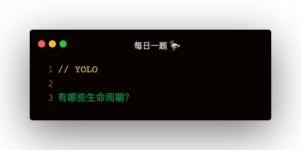

### 解答
#### 老的生命周期
1. 初始化：constructor
2. 装载：componentWillMount，render，componentDidMount
3. 更新：componentWillReceiveProps，shouldComponentUpdate，componentWillUpdate，render，componentDidUpdate
4. 卸载：componentWillUnmount

#### 新的生命周期
1. 初始化：constructor
2. 装载：getDerivedStateFromProps，render
3. 更新：getDerivedStateFromProps，shouldComponent，render，getSnapshotBeforeUpdate，componentDidUpdate
4. componentWillmount

#### 生命周期改动
1. 废除了三个 will 系生命周期：componentWillMount，componentWillReceiveProps，componentWillUpdate
2. 增加了两个生命周期：getDerivedStateFromProps，getSnapshotBeforeUpdate

#### getDerivedStateFromProps
当初始化和更新时，组件会在 constructor 之后先走 getDerivedStateFromProps，可以在这个生命周期中返回一个json，映射为当前的state
```
class Child extends React.Component {
    constructor (props) {
        super(props);

        this.state = { time: '' }
    }

    static getDerivedStateFromProps (nextProps) {
        return {
            time: nextProps.time
        }
    }
}
```

#### getSnapshotBeforeUpdate
在更新之前返回一个快照 snapshot，可以在 componentDidUpdate 中第三个参数获取
```
getSnapshotBeforeUpdate () {
    return {}
}
componentDidUpdate (prevProps, prevState, snapshot) {

}
```   

**使用场景：**   
比如往网页头部插入元素，会导致网页往下移，此时可以用 getSnapshotBeforeUpdate 先记录更新前的 scrollTop