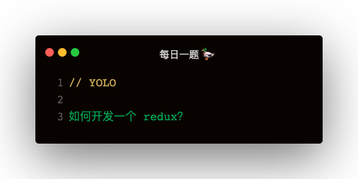

### Redux 的基础应用
基础的四个方法：createStore，getState，subscribe，dispatch
```
function reducer (state, action) {
    switch (action.type) {
        case 'ADD':
            return ++state;
        case 'MINUS':
            return --state;
        default:
            return state;
    }
}
const store = createStore(reducer, initialState);
const unsubscribe = store.subscribe(() => {
    console.log('state发生变化了', store.getState());
})
store.dispatch({ type: 'ADD' });

unsubscribe();
```

#### 基础架构实现
需要注意的点：
1. 如何防止 unsubscribe 多次调用
2. 如何判断是否是个纯对象
```
function createStore (reducer, initialState) {
    let currentState = initialState;
    let currentReducer = reducer;
    let currentListeners = [];

    function getState () {
        return currentState;
    }

    function subscribe (listener) {
        if (typeof listener !== 'function') {
            throw new Error('订阅参数必须为函数')
        }

        let idx = currentListeners.push(listener);
        let isSubscribed = true;
        function unsubscribe () {
            if (!isSubscribe) {
                return
            }
            currentListeners.splice(idx - 1, 1);
            isSubscribe = false
        }
    }

    function dispatch (action) {
        if (!isPlainObject(action)) {
            throw new Error('action 必须是个纯对象')
        }
        if (!action || action.type) {
            throw new Error('action 必须要有一个type属性')
        }
        currentState = currentReducer(currentState, action);
        for (let listener of currentListeners) {
            listener();
        }
    }

    return {
        getState,
        dispatch,
        subscribe,
    }
}
```

#### 纯对象
对象的原型是 Object.prototype
```
function isPlainObject (obj) {
    if (typeof obj !== 'object' || obj === null) {
        return false;
    }
    return Object.getPrototypeOf(obj) === Object.prototype
}
```