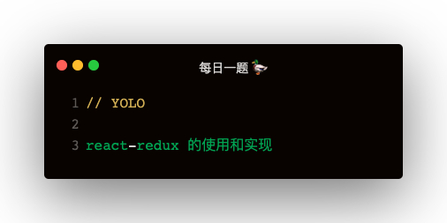

### ReactReduxContext
```
import { ReactReduxContext } from 'react-redux'
<ReactReduxContext.Provider value={store}>
    <App />
</ReactReduxContext.Provider>

static contextType = ReactReduxContext
this.context.getState()
```

#### ReactReduxContext实质
其实就是个 Context
```
const ReactReduxContext = React.createContext();
export {
    ReactReduxContext
}
```

### Provider + connect 使用
```
<Provider store={store}></Provider>

connect(
    state => ({ ...state }),
    dispatch => ({
        add () {
            dispatch({ type: 'ADD' })
        }
    }),
    mergeOptions (stateProps, dispatchProps, ownProps) {}
)
```

#### Provider 和 connect 实现
```
export const ReduxContext = React.createContext();
class Provider extends React.Component {
    render () {
        return <ReduxContext.Provider value={this.props.store}>
            { this.props.children }
        </ReduxContext.Provider>
    }
}


const connect = (mapStateToProps, mapDispatchToProps, mergeOptions) => {
    return InnerComponent => {
        return class extends React.Component {
            static contextType = ReduxContext;
            constructor () {
                super();
                this.state = { state: null }
            }
            
            componentDidMount () {
                const store = this.context;
                this.setState({ state: store.getState() });
                store.subscribe(() => {
                    if (this.state.state !== store.getState()) {
                        this.setState({ state: store.getState() });
                    }
                })
            }

            render () {
                const store = this.context;
                const state = store.getState();
                const dispatch = store.dispatch;
                const stateProps = mapStateToProps ? mapStateToProps(state) : {};
                const dispatchProps = mapDispatchToProps ? mapDispatchToProps(dispatch) : {};
                const props = mergeOptions ? mergeOptions(stateProps, dispatchProps, this.props) : { ...stateProps, ...dispatchProps, ...this.props };

                return <InnerComponent {...props} />
            }
        }
    }
}
```

### bindActionCreators
**此方法的用处：**   
传入 actionCreators 和 dispatch，获得的是绑定了dispatch的函数   
**好处：**   
只要把 bindActionCreators 的返回值作为属性传入子组件，子组件直接 this.props.add 就行了，不用传dispatch
```
const actionCreators = {
    add: () => { type: 'ADD' },
    minus: () => { type: 'MINUS' }
}

或者

function actionCreators () {
    return { type: 'ADD' }
}
```

#### bindActionCreators 的实现
```
function bindActionCreator (actionCreator, dispatch) {
    return function (this, ...args) {
        return dispatch(actionCreator.apply(this, args));
    }
}
function bindActionCreators (actionCreators, dispatch) {
    if (typeof actionCreators === 'function') {
        return bindActionCreator(actionCreators, dispatch)
    } else {
        let boundActionCreators = {}
        for (let key in actionCreators) {
            const actionCreator = actionCreators[key];
            if (typeof actionCreator === 'function') {
                boundActionCreators[key] = bindActionCreator(actionCreator, dispatch)
            }
        }
        return boundActionCreators;
    }
}
```