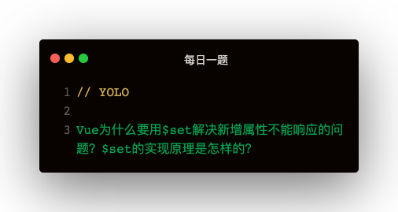

**解答：**
是因为Vue在实例化的过程中就需要对data中的数据使用defineProperty方法来定义存取器实现的响应式。   
而直接新增属性因为仍是值属性，所以是不能实现响应式的

源码实现   
```
const isValidArrayIndex = index => {
  return index > 0 && Math.floor(index) === index && isFinite(index)
}
exprt function set (target, key, val) {
  if (Array.isArray(target) && isValidArrayIndex(key)) {
    target.length = Math.max(target.length, key)
    target.splice(key, 1, val)
    return val
  }
  if (key in target && !(key in target.prototype)) {
    target[key] = val
    return val
  }
  const __ob__ = target.__ob__
  if (!__ob__) {
    target[key] = val
    return val
  } else {
    defineReactive(__ob__.value, key, val)
    __ob__.dep.notify()
    return val
  }
}
```

set分为四步骤：   
- 判断是否为数组，以及索引是否合法
  - Array.isArray判断target是否为数组
  - 索引是否合法：index > 0 && Math.floor(index) === index && isFinite(index)
  - 数组可能不够长，先把数组扩充下：target.length = Math.max(target.length, key)
  - 通过splice往数组中添加：target.splice(key, 1, val)
- 判断target对象下是否已经该属性key
  - 存在的话就是修改操作，直接target[key] = val，通过setter存取器触发notify
- target是否已被响应式
  - 否：不管响应式，target[key] = val完事
  - 已设置响应式，defineReactive(ob.value, key, val), ob.dep.notify()触发更新   

### defineProperty的缺点
从这个问题可以看出：defineProperty实现响应式，需要在vue实例化时对所有属性进行重定义，不然的话就不能实现响应式   
有点类似事件绑定时，对单个节点

### Proxy的使用
```
let obj = { a: 1, b: 2 }
let obj1 = new Proxy(obj, {
    get (obj, prop) {
        console.log(`正在获取属性：${prop}，值为：${obj[prop]}`)
        return obj[prop]
    }
})

obj1.a
obj1.b
```

Proxy类似事件委托，把属性访问委托到另一个对象上，可是不具体关心是什么属性，所以在Vue实例化阶段减少了对data下所有属性进行defineProperty定义存取器