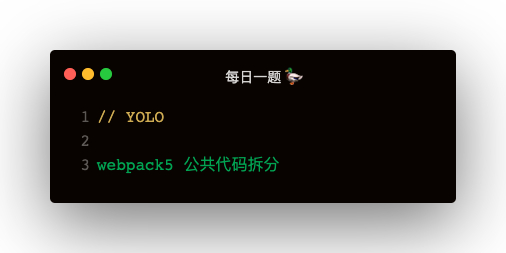
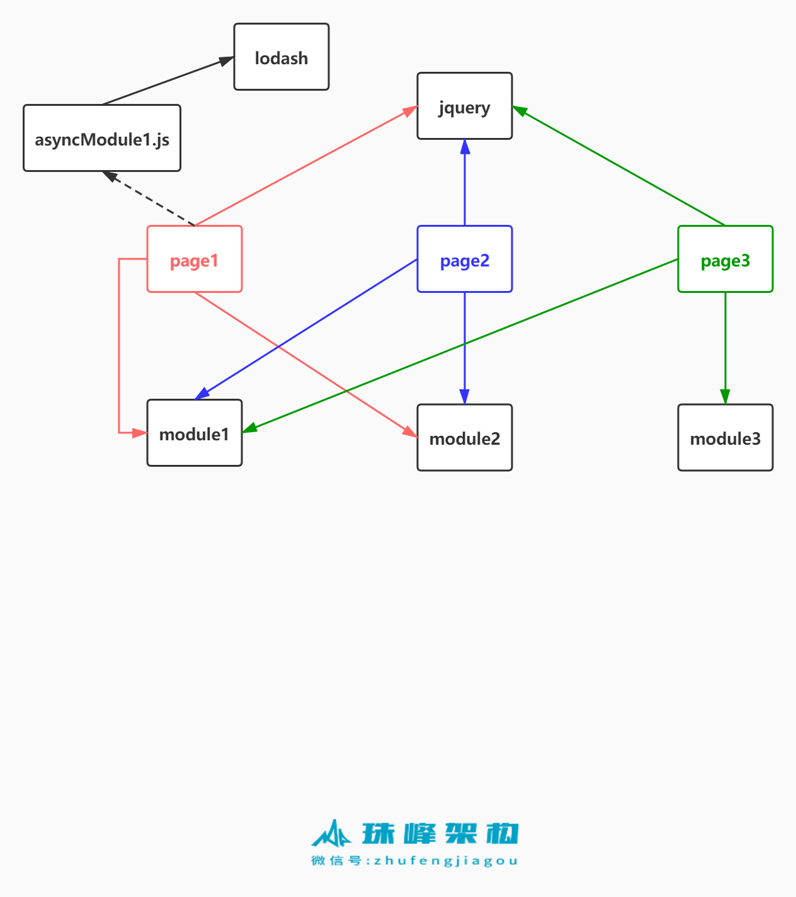

### 场景


### webpack 的默认拆分
默认不配置 splitChunks，出来四个打包文件
```
- page1.js
- page2.js
- page3.js
- 3.js
```

### splitChunks
webpack 公共代码拆分主要依赖 SplitChunksPlugin，配置 optimization
```
optimization: {
    splitChunks: {
        async：只提取动态 import 代码，initial：提取同步代码（直接引入的模块），all：所有
        chunks: 'async | all | initial',

        分割出去的代码块的最大最小体积，0表示不限制
        minSize: 0,
        maxSize: 0,

        如果此模块被多个入口引用几次会被分割
        minChunks: 1,
        
        异步请求和同步请求最多分割出去多少个代码块
        maxAsyncRequests: 30,
        maxInitialRequests: 30,

        名称的分割符 vendors~main.js => page1~module1_jsf51c7e26.js
        automaticNameDelimiter: '~',

        缓存组配置 配置如何对模块分组相同分组会分到一个代码块中
        cacheGroups: {
            第三方模块
            defaultVendors: {
                如果模块的路径匹配此正则的话
                test: /[\\/]node_modules[\\/]/,
                很多缓存组，如果一个模块同属于多个缓存组，应该分到哪个组里，看优先级高
                priority: -10,
                是否可复用现有的代码块，如果为 true 则表示如果当前的 chunk 包含的模块已经被抽取出去了
                reuseExistingChunk: true
            },
            default: {
                此模块最几个入口引用过，最少2个才取提取
                minChunks: 2,
                priority: -20,
                reuseExistingChunk: true
            }
        }
    }
}
```