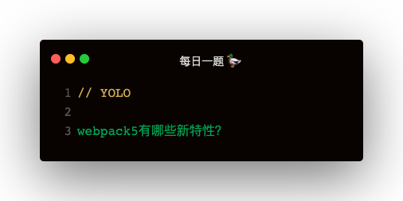
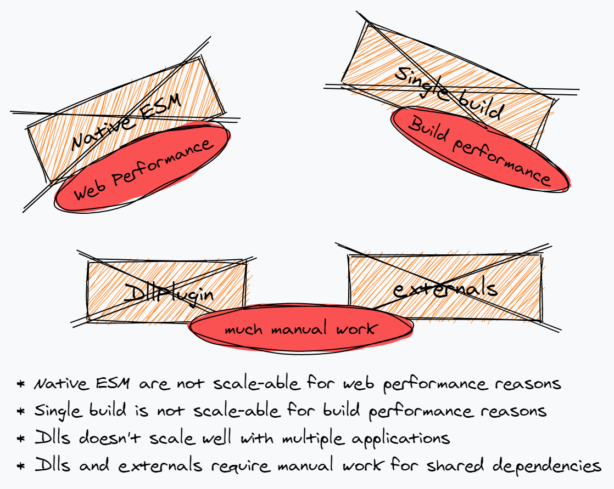

### 新特性
1. 持久化缓存
2. 资源模块
3. moduleIds chunkIds优化
4. tree-shaking
5. 模块联邦

#### 持久化缓存
开启持久化缓存，不配置的话默认不开启缓存，试过打包时间都差不多
```
cache: {
    type: 'memory | filesystem',
    cacheDirectory: path.resolve(__dirname, 'node_modules/.cache/webpack')
}
```

#### 资源模块
webpack4 的资源模块加载:
1. file-loader 加载文件，并返回 url
2. url-loader 加载文件，并返回 base64 编码
3. raw-loader 加载文件，并返回文件字符串内容

```
{
    test: /\.jpg$/,
    loader: 'file-loader | url-loader | raw-loader'
}
```   

webpack5 中内置了这些 loader，配置更简单：
```
file-loader
{
    test: /\.jpg$/,
    type: 'asset/resource'
}

url-laoder
{
    test: /\.jpg$/,
    type: 'asset/inline'
}

自动根据文件大小判断使用 file-loader 还是 url-loader
{
    test: /\.jpg$/,
    type: 'asset',
    parser: {
        dataUrlCondition: {
            maxSize: 10 * 1024
        }
    }
}

raw-loader
{
    test: /\.txt$/,
    type: 'asset/source'
}
```

#### moduleIds chunkIds 优化
webpack4 中
1. moduleIds 使用的是 named 命名方式，即 ./a.js 路径作为 key
2. chunkIds 使用的是 natural 命名方式，即 1.js 之类的引用顺序数字作为 chunkName   

**这种方式有个问题：**   
webpack4 中非入口模块的命名是按照引用顺序数字命名的，如果某个文件被删除，会导致之后的文件缓存失效，webpack5 中 chunkIds 默认采用 named 的命名方式

1. natural: 数字顺序命名
2. named: 文件路径命名方式，module 如 ./a.js，chunk 如 src_c_js.js
3. deterministic: 根据模块名称生成简短的三位 hash 值作为文件名，chunk 数超过 999 会冲突
4. size: 试过是看文件个数   

**配置**
```
output: {
    filename: '[name].[hash:8].js',
    chunkFilename: '[name].[hash:8].js'
},
optimization: {
    moduleIds: 'deterministic',
    chunkIds: 'deterministic'
}
```

#### 更强大的 tree-shaking
webpack v5 对 tree-shaking 进行了增强
1. 嵌套 tree-shaking
2. commonjs tree-shaking

##### 嵌套 tree-shaking
下面这个例子，v4 会打包 bbbbb，v5不会打包
```
// inner.js
export const aaaaa = 1;
export const bbbbb = 1;

// module.js
import * as inner from './inner'
export default {
    aaaaa
}

// index.js
import module from './module'
console.log(module.inner.aaaaa)
```

##### commonjs tree-shaking
v4 的 tree-shaking 是基于 import 的，v5 中增加了 commonjs 支持
```
// module.js
exports.aaaaa = function () {
    console.log('aaaaa')
};
exports.bbbbb = function () {
    console.log('bbbbb')
};

// index.js
const aaaaa = require('./module').aaaaa;
aaaaa();
```

##### development 模式如何查看未使用的export
```
optimization: {
    usedExports: true
}
```

##### 模块未使用到但是改变了全局变量如何处理
举个例子
```
document.title = 'tree-shaking'
function aaa () {
    console.log('aaa')
}
```   
这个例子中 document.title 会被保留，aaa会被删除   
**通过设置 sideEffects 可以使 document.title 也被删除**
```
// package.json
{
    sideEffects: false
}
```   

如果是 import 'index.css' 怎么办，配置了 sideEffects 会导致 css也被删除
```
// package.json
{
    sideEffects: '*.css'
}
```

##### 告知 webpack 此方法是纯函数，可以被 shaking
```
var Person = /*#__PURE__*/function () {
    function Person () {};
    return Person;
}
```

### 模块联邦
动机：多个团队一起开发一个或多个应用程序，应用程序被拆分成小部分，可以是 UI 组件，也可以是数据请求，或其他业务组件
优点：
1. 组件热更新，异步组件运行时性能好
2. 分别打包，打包性能好
3. 依赖共享，如 React 等

#### remote 项目导出组件
```
const ModuleFederationPlugin = require('webpack/lib/container/ModuleFederationPlugin');

plugins: [
    new ModuleFederationPlugin({
        name: 'AddressProject',
        filename: 'AddressForm.js',
        exposes: {
            './AddressForm': './components/AddressForm'
        }
    })
]
```

#### hosts 项目使用组件
webpack 配置文件声明
```
const ModuleFederationPlugin = require('webpack/lib/container/ModuleFederationPlugin');

plugins: [
    new ModuleFederationPlugin({
        name: 'cartProject',
        remotes: {
            addrProj: 'AddressProject@http://localhost:8080/AddressForm.js'
        }
    })
]
```   

组件使用
```
const AddressForm = React.lazy(() => import('addrProj/AddressForm'));

<React.Suspense fallback={<div>remote component loading</div>}>
    <AddressForm />
</React.Suspense>
```

### 跨框架不可行
一个项目 React，一个项目 Vue，是无法共享组件的   
Vue 中异步组件
```
components: {
    Header: () => import('address/AddressForm')
}
```

### 相比其他的有点

ModuleFederationPlugin 与本地模块，npm 打包，dll，externals相比较   
参考网址：https://github.com/sokra/slides/blob/master/content/ModuleFederationWebpack5.md
