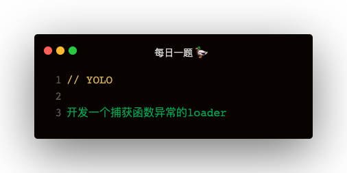

### 解答
基本就是在 https://astexplorer.net/ 写一遍，然后根据类型，参考 https://babeljs.io/docs/en/babel-types 创建类型加入即可

```
const babel = require('@babel/core')
const t = require('@babel/types')

const ErrorCapturePlugin = {
    visitor: {
        Program (path) {
            path.node.body = [
                t.functionDeclaration(
                    t.identifier('errorCapture'),
                    [ t.identifier('e') ],
                    t.blockStatement([
                        t.expressionStatement(
                            t.callExpression(
                                t.memberExpression(
                                    t.identifier('console'),
                                    t.identifier('log')
                                ),
                                [ t.stringLiteral('发生异常：') , t.identifier('e') ]
                            )
                        ),
                        t.expressionStatement(
                            t.callExpression(
                                t.memberExpression(
                                    t.identifier('navigator'),
                                    t.identifier('sendBeacon')
                                ),
                                [
                                    t.stringLiteral('/log'),
                                    t.callExpression(
                                        t.memberExpression(
                                            t.identifier('JSON'),
                                            t.identifier('stringify')
                                        ),
                                        [
                                            t.identifier('e'),
                                        ]
                                    )
                                ]
                            )
                        )
                    ])
                ),
                ...path.node.body
            ]
        },
        FunctionDeclaration (path) {
            const node = path.node
            if (node.id.name !== 'errorCapture') {
                // 把try catch 指定给函数体
                node.body = t.blockStatement([
                    t.tryStatement(
                        node.body,
                        t.catchClause(
                            t.identifier('e'),
                            t.blockStatement([
                                t.expressionStatement(
                                    t.callExpression(
                                        t.identifier('errorCapture'),
                                        [ t.identifier('e') ]
                                    )
                                )
                            ])
                        )
                    )
                ])
            }
        }
    }
}

module.exports = function (source) {
    const reult = babel.transform(source, {
        plugins: [ ErrorCapturePlugin ]
    })

    console.log('reult:', reult.code)
    return reult.code
}
```