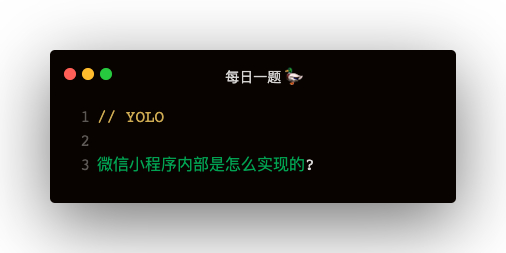

### 微信小程序架构
1. 分为视图层和逻辑层两个线程，视图层负责wxml，wxss的渲染，逻辑层负责js的执行
2. 两个线程通信通过 native 提供的 jsbridge
3. 视图层有 WAWebview.js，逻辑层有 WAService.js，两个底层库提供了通信，内置组件WebComponent等功能
4. js 的处理有 jsCore 单进程处理，视图层每个 Page 都是一个 webview 进程

