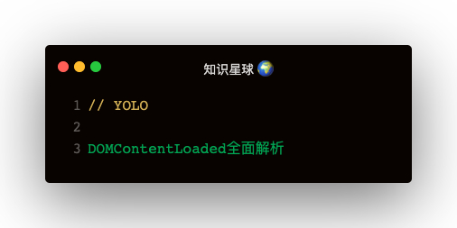

#### DOMContentLoaded
初始HTML文档被完全加载和解析完成之后，DOMContentLoaded事件被触发

##### 什么时候算是文档加载完？
> 同步javascript会暂停DOM的解析   

```
document.addEventListener('DOMContentLoaded', function () {
  console.log('DOMContentLoaded:', (Date.now() - domStart))
})
const start = Date.now()
while (true) {
  const end = Date.now()
  if (end - start > 5000) {
    break
  }
}
console.log('script loaded!')
```   
可以发现当时间是5000时，DOMContentLoaded的时间为5048，而while的时间为1000时，DOMContentLoaded的时间为1048   
所以：**同步的JS文档阻塞了DOM的解析**   


##### async 和 defer对于DOMContentLoaded的影响
```
<script>
  document.addEventListener('DOMContentLoaded', function () {
    console.log('DOMContentLoaded:', (Date.now() - domStart))
  })
</script>
<script src="./test.js" async></script>

<!-- test.js -->
const start = Date.now()
while (true) {
  const end = Date.now()
  if (end - start > 5000) {
    break
  }
}
console.log('script loaded!')
```   

出现了两种不同情况：
- async
  - **async是异步加载，加载完成便执行**
    - document.addEventListener('DOMContentLoaded', ...)在前面，DOMContentLoaded 马上执行
    - <script src="test.js"></script>在前面，就看js的下载速度了，在执行DOMContentLoaded之前下载完成，DOMContentLoaded的时间就是5048
- **defer**
  - **该属性用来通知浏览器该脚本将在文档完成解析后，触发DOMContentLoaded事件前执行**
  - 所以这里DOMContentLoaded时间是5048

#### readyState
readyState是一个只读属性   
readyState的三种状态：
1. loading
2. interactive
3. complete   

readyState改变的事件：document.onreadystatechange

##### readyState跟DOMContentLoaded的关联
DOMContentLoaded事件必须是在document.readyState为loading时绑定才有效   
```
const script = document.createElement('script')
script.src="./test.js"
document.body.appendChild(script)

<!-- ./test.js -->
console.log('test.js load')
document.addEventListener('DOMContentLoaded', function () {
  console.log('DOMContentLoaded')
})
```   

这个🌰 可以看到：DOMContentLoaded事件未被执行   

readyState和DOMContentLoaded执行顺序：
```
readyState: loading
        ↓
readyState: interctive
        ↓
DOMContentLoaded事件
        ↓
readyState: complete
        ↓
      load事件
```

##### js代码放在文档最后
此时js是不需要像下面这样写的
```
$(document).ready(function() {
  // 少年的你，代码写在这里...
});
```   

其实js在文档最后，文档已经解析好了，所以只需要像下面这样写就行了：
```
(function() {
  // 这里代码...
})();
```   

优点是：执行时机更快

#### readyState现在还有啥锤子用？
判断时机为loading，绑定DOMContentLoaded事件
```
if (document.readyState != 'loading') {
  init();
} else {
  window.addEventListener("DOMContentLoaded", function () {
    init();
  });
}
```