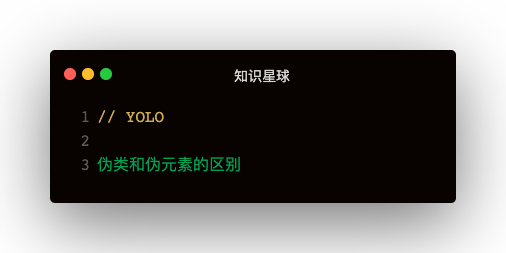

#### 解答
区别：
- 表示方法
  - CSS2中伪类和伪元素都是用:声明，CSS2.1中伪类用:，伪元素用::
  - 浏览器同样接受CSS2时代已存在的单冒号写法，比如:before, :after等
  - CSS2之后所有新增的伪元素，如::selection
- 定义不同
  - 伪类即假的类，可以添加类来达到效果
  - 伪元素即假元素，需要通过添加元素才能达到效果

相同点：
- 同为文档树以外的"元素"，在html源文件中是看不到伪类和伪元素的

#### 扩展
伪类的顺序需要遵循什么规则？   
LVHA：link visited hover active   
为了避免hover样式失效，需要遵循这样的规则定义伪类