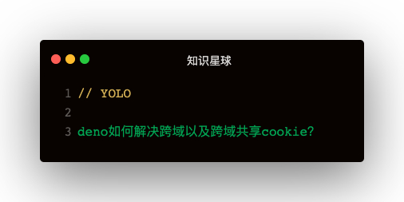

### 解答

```
import { oakCors } from 'https://deno.land/x/cors/mod.ts'
app.use(oakCors({ credentials: true, optionsSuccessStatus: 200, origin: true }))
```   

需要配置如下两个字段：
1. credentials: Access-Control-Allow-Credentials
2. origin: Access-Controle-Allow-Origin