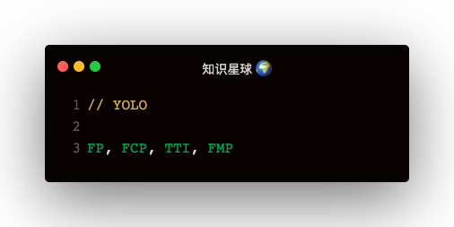

#### 名词解释
1. FP：first paint
2. FCP：first content paint
3. TTI：time to interactive
4. FMP：first meaningful paint
5. LCP：largest contentful paint
6. FID：first input delay

#### 跟踪FP/FCP
```
const observer = new PerformanceObserver(list => {
  for (const entry of list.getEntries()) {
    const metricName = entry.name
    const time = Math.round(entry.startTime + entry.duration)
    console.log('entry: ', entry)
  }
})
observer.observe({ entryTypes: ['paint'] })
```   

#### 追踪LCP
最大内容绘制：浏览器自己判断
```
const observer = new PerformanceObserver(list => {
  for (let entry of list.getEntries()) {
    console.log(entry)
  }
})
observer.observe({ type: 'largest-contentful-paint' })
```   

#### 追踪FMP
```
<!-- FMP元素是需要开发者手动指定的，不然浏览器不知道那个节点是有意义的元素 -->
el.setAttribute('elementimg', 'meaningful')

const observer = new PerformanceObserver(list => {
  for (let entry of list.getEntries()) {
    console.log(entry)
  }
})
observer.observe({ type: 'element' })
```   

FMP的entry结果是：
1. entryType: "element"
2. identifier: "meaning"

#### 跟踪TTI
google chrome有个库：tti-polyfill，可以借助这个库收集tti

#### 跟踪FID：第一次输入延迟
```
const firstHiddenTime = document.visibilityState === 'hidden' ? 0 : Infinity
document.addEventListener('visibilitychange', event => {
  firstHiddenTime = Math.min(firstHiddenTime, event.timeStamp)
})
const observer = new PerformanceObserver(list => {
  for (let entry of list.getEntries()) {
    if (entry.startTime < firstHiddenTime) {
      const fid = entry.processingStart - entry.startTime
      console.log('第一次输入延迟：', fid)
    }
  }
})
observer.observe({ type: 'first-input', buffered: true })
```

#### 跟踪长任务
entryTypes: ['longtask']

#### 跟踪输入延迟
btn.addEventListener('click', event => {
  const lag = performance.now() - event.timeStamp;
  if (lag > 100) {
    console.log('输入延迟')
  }
})

#### 计算用户的逗留时长
使用document的visibilitychange事件来触发浏览器标签页隐藏和显示的回调

##### paint可以获取两个指标
1. name: 'first-paint'
2. name: 'first-contentful-paint'   

entry对象中有entryType, startTime, duration, name四个属性

##### entryType有哪些
1. frame，navigation
2. resource
3. mark
4. measure
5. paint