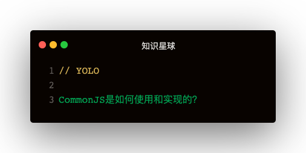

#### CommonJS模块基本语法
```
module.exports = {
  name: 'leo'
}

exports.name = 'leo'

exports = { name: leo } ❌ 这是不行的，因为切断了exports和module.exports之间的引用
```   

#### CommonJS的自定义实现
```
const fs = require('fs')
const vm = require('vm')
const path = require('path')
const Module = {
  wrapper: [
    '(function (require, module, exports, __filename, __dirname) {',
    '})'
  ],
  _cache: {}
}

function customRequire (filepath) {
  const filename = path.resolve(__dirname, filepath)
  if (Module._cache[filename]) {
    return Module._cache[filename]
  }
  let module = Module._cache[filename] = {
    id: filename,
    l: false,
    exports: {}
  }
  const content = fs.readFileSync(filename)
  const func = new vm.Script(Module.wrapper[0] + content + Module.wrapper[1]).runInThisContext()
  func(customRequire, module, module.exports, filename, path.dirname(filename))
  return module.exports
}
```
