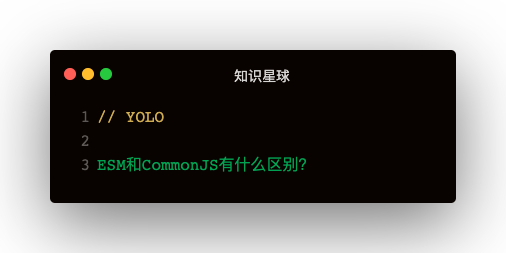

#### 解答
1. ESM导出的是值的引用，CommonJS导出的是值的拷贝
2. 循环引用两者的处理有区别
3. CommonJS是运行时加载，ESM是编译时输出接口

##### 导出的区别
ESM导出的时候，👇：
```
export const name = 'leo'
👇 会被解析为：
__webpack_require__.d(
  __webpack_exports__,
  'name',
  function () {
    return name
  }
)
```   
其实是使用defineProperty的方法把name的getter设置到__webpack_exports__上面，但是实际取的还是外部的name，这里用了闭包特性   

CommonJS导出的时候却是这样实现的👇：
```
const content = fs.readFileSync(filename)
new vm.Script(Module.wrapper[0] + content + Module.wrapper[1]).runInThisContext()
```   

从两者的实现可以看出：ESM导出值的引用，而CommonJs导出值的拷贝   

#### 循环引用
循环引用指的是：a引用b，b又引用a

##### 先存缓存的重要性
在实现ESM和CommonJS的过程中，都可以发现还未执行模块，就先把模块存入了缓存：
```
let module = Module._cache[filename] = {
  if: filename,
  l: false,
  exports: {}
}
```   

**这是因为如果不先存入缓存，循环引用会导致内存溢出，先存入缓存之后取直接取缓存返回**   

##### 输出已执行部分
因为ESM做得比较好，不能重复导出相同属性，所以这里拿CommonJS来实验：
```
<!-- 1.js -->
exports.name1 = 'leo1'
const m2 = require('./2.js')
exports.name1 = 'leo11'
console.log(m2.name2)

<!-- 2.js -->
const m1 = require('./1.js')
console.log(m1.name1)
exports.name2 = 'leo2'
```   
这里1.js和2.js循环引用，在导入2.js之前name1为leo1，导入2.js之后name1为leo11。可以发现2.js中输出的name1为leo1   
**CommonJS 模块遇到循环加载时，返回的是当前已经执行的部分的值，而不是代码全部执行后的值**   

##### 循环引用中使用了未定义的变量，什么反应？
如果把1.js中的name='leo1'删除，可以发现直接是undefined了，对两个文件稍作加工👇：
```
<!-- 1.js -->
const m2 = require('./2.js')
exports.name1 = function () {
  return 'leo11'
}
console.log(m2.name2)

<!-- 2.js -->
const m1 = require('./1.js')
console.log(m1.name1())
exports.name2 = 'leo2'
```   
CommonJS直接报错：m1.name1 is not a function   

换成ESM试下：
```
<!-- 1.js -->
import { name2 } from './2.js'
export function name1 () {
  return 'leo11'
}
console.log(name2)

<!-- 2.js -->
import { name1 } from './1.js'
console.log(name1())
export const name2 = 'leo2'
```   

发现输出了leo11 leo2，说明可以，因为**函数提升**   

可以想象：函数表达式也是不行的，因为虽然可以变量提升，但是变量仍是undefined
