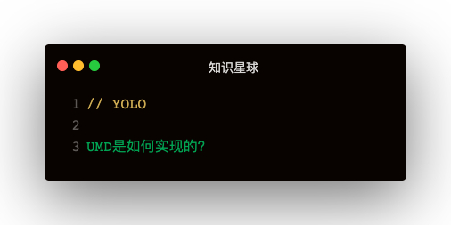

```
(function (global, factory) {
  typeof exports === 'object' && typeof module !== 'undefined' ?
    module.exports = factory()
    : (
        typeof define === 'function' && define.amd ?
          define(factory)
          : (global.libName = factory())
      )
})(this, function () { 'use strict' })
```