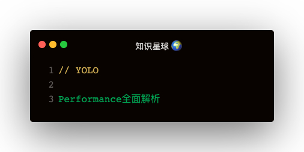

#### Performance
##### 属性
- navigation 返回一个PerformanceNavigation对象
  - 两个属性
    - type
      - 0：通过点击链接，书签和表单提交，或者脚本操作，或者输入url
      - 1：刷新页面按钮，或者Location.reload()
      - 2：历史记录和前进后退访问
      - 255：任何其它方式
    - redirectCount：到达当前页面之前被重定向次数
- timing 返回一个PerformanceTiming对象，⚠️ 从Navigation Timing v2中已被废弃，要求用Performance.timeOrigin替代
  - navigationStart
  - unloadEventStart
  - unloadEventEnd
  - redirectStart
  - redirectEnd
  - fetchStart
  - domainLookupStart
  - domainLookupEnd
  - connectStart
  - connectEnd
  - secureConnectionStart
  - requestStart
  - responseStart
  - responseEnd
  - domLoading
  - domInteractive
  - domContentLoadedEventStart
  - domContentLoadedEventEnd
  - domComplete
  - loadEventStart
  - loadEventEnd
- memory
  - ⚠️ chrome提供的一个非标准扩展，可以获取到基本内存使用情况的对象
- timeOrigin
  - 返回性能测量开始时的时间   

##### 方法
- clearMarks
- clearMeasures
- clearResourceTimings
- getEntries
- getEntriesByName
- getEntriesByType
- mark
- measure
- now
- toJSON

##### mark clearMarks getEntriesByName getEntriesByType
> mark: 在浏览器的性能缓冲区中使用给定名称添加一个timestamp
```
// 标记一个时间点
performance.mark('appStart')
// 根据名称获取标记时间点
performance.getEntriesByName('appStart')
// 获取mark类型的记录
performance.getEntriesByType('mark')
// 清楚标记
performance.clearMarks()
// 获取所有记录
performance.getEntries()
```   

##### entry的值
```
duration: 0,
entryType: 'paint',
name: 'first-paint',
startTime: 161.8000
```   

##### measure clearMeasures
计算两个标记点的时间差
```
performance.mark('appStart')
performance.mark('appEnd')
performance.measure('app', 'appStart', 'appEnd')
performance.clearMeasures()
```  

