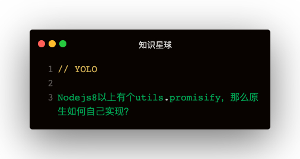

### 解答
```
function promisify (func) {
  return function (...args) {
    return new Promise((resolve, reject) => {
      const argsWithCallback = [...args, function (error, content) {
        error ? reject(error) : resolve(content)
      }]
      func.apply(func, argsWithCallback)
    })
  }
}
```