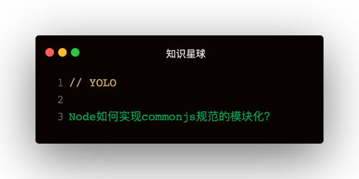

### 解答
```
const fs = require('fs')
const vm = require('vm')

let Module = {
  wrapper : [
    '(function (exports, require, module) {\n',
    '\n})'
  ],
  _cache: Object.create(null)
}
const customRequire = function (moduleId) {
  if (Module._cache[moduleId]) {
    return Module._cache[moduleId]
  }

  const script = fs.readFileSync(moduleId)
  const module = { exports: {} }
  Module._cache[moduleId] = module

  const func = new vm.Script(Module.wrapper[0] + script + Module.wrapper[1]).runInThisContext()
  func(module.exports, customRequire, module)
  return module.exports
}

module.exports = customRequire
```