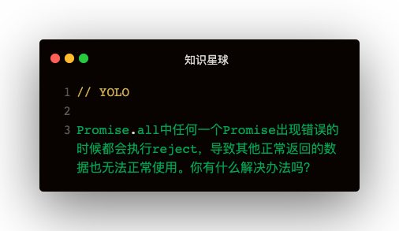

### 解答

可以使用新api -> allSettled解决，有请求出错仍会进入.then，结果格式如下👇：   
```
[
  { statue: 'fullfilled', value: 1 },
  { statue: 'fullfilled', value: 2 },
  { statue: 'rejected', value: 3 },
]
```   

像vscoder插件Code Runner里面跑Promise，是没有allSettled方法的，那么可以自己实现一个👇：   
```
if (!Promise.allSettled) {
  Promise.allSettled = promises => {
    let _promises = []
    for (let promise of promises) {
      _promises.push(promise.then(value => {
        return Promise.resolve({ status: 'fullfilled', value })
      }).catch(value => {
        return Promise.resolve({ status: 'rejected', value })
      }))
    }
    return Promise.all(_promises)
  }
}
Promise.allSettled([
  new Promise(resolve => {
    setTimeout(() => resolve(1), 1000)
  }),
  new Promise(resolve => {
    setTimeout(() => resolve(2), 2000)
  }),
  new Promise((resolve, reject) => {
    setTimeout(() => reject(3), 3000)
  })
]).then(res => {
  console.log('结果：', res)
}).catch(e => {
  console.log('异常：', e)
})
```