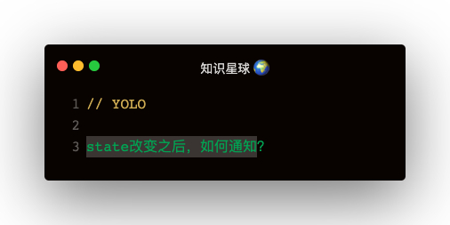

### 解答
```
用法：
store.subscribe(() => {
  console.log('subscribe store')
})

function subscribe () {
  nextListeners.push(listener)
  return function unsubscribe() {
    const index = nextListeners.indexOf(listener)
    nextListeners.splice(index, 1)
  }
}
```