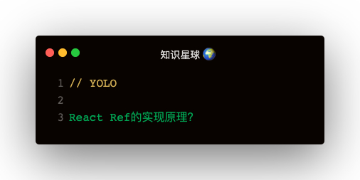

### ref的三种用法
string模式的已被废弃
```
1. 回调函数模式
ref = { el => this.el = el }

2. createRef
this.ref = React.createRef()
ref = {this.ref}

3. forwardRef
React.forwardRef((props, ref) => (
  <div ref={ref}></div>
))
```

### createRef
```
function createRef () {
  const refObject = {
    current: null
  }
  return refObject
}
```