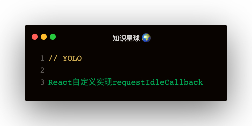

#### 为什么React放弃使用原生requestIdleCallback?
了解几个名称：   
FPS：frame per second，每秒的帧数

#### 帧的几个问题
- setTimeout(callback) 和 setInterval(callback)

#### 实现原理
react使用requestAnimationFrame + MessageChannel 实现requestIdleCallback的polyfill版本：
```
let frameDeadline
let activeFrameTime = 16
let channel = new MessageChannel()
let port = channel.port2
channel.port1.onmessage = () => {
  const currentTime = performance.now()
  console.log('当前时间:', currentTime)
  console.log('当前帧剩余时间:', frameDeadline - currentTime)
}

const startTime = performance.now()
const requestAnimationFrameCircle = () => {
  requestAnimationFrame(timestamp => {
    frameDeadline = timestamp + activeFrameTime
    port.postMessage(undefined)
    if (performance.now() - startTime < 1000) {
      requestAnimationFrameCircle()
    }
  })
}

requestAnimationFrameCircle()
```