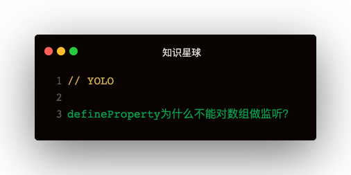

### 解答
回答这个问题之前，先来回顾下defineProperty实现监听的原理：   
**重定义属性的值属性为存取器属性，在存取器中进行访问拦截，从而实现监听**

#### defineProperty可以监听数组吗？
数组它有键值对，比如下面👇：
```
const arr = [1, 2, 3]
arr[0]
<!-- arr[0]为1 -->
```

键为0，值为1，那么有键值对就能进行监听👇   


```
function walk (obj) {
  const keys = Object.keys(obj)
  for (let key of keys) {
    defineReactive(obj, key, obj[key])
  }
}
function defineReactive (obj, key, val) {
  Object.defineProperty(obj, key, {
    configurable: true,
    enumerable: true,
    get () {
      console.log(`getter: ${key}: ${val}`)
      return val
    },
    set (newVal) {
      console.log(`setter: ${key}: ${val}: ${newVal}`)
      val = newVal
    }
  })
}

const arr = [1, 2, 3]
walk(arr)
arr[0]
arr[0] = 2
console.log(arr[0])
```   

这段代码执行输出下，可以看到也实现了数组的监听，那么为啥Vue1和2不是这么实现的呢？

#### defineProperty监听数组的问题
1. 新增属性无法监听
2. 数组的重复存取监听   

##### 新增属性无法监听
还是上面的基础代码，再来试试下面几种场景：   
1. arr[3] = 4
2. arr.push(4)   

这些场景都无法触发存取器拦截，因为定义的索引为3的属性是属于值属性，并没有重写存取器拦截   

**其次如果删除了一个索引，然后重新赋值，也是一样**   
```
delete arr[1]
arr[1] = 4
arr[1]
```   

执行上面代码可以发现，set和get都没有进，很简单：**因为arr[1]=4是值属性，之前的存取器属性已被删除，所以已无法拦截**   

##### 数组的重复存取监听
在前面的基础代码上执行一下unshift：   
```
arr.unshift(0)
```   
会发现控制台输出了一坨：
```
getter: 2: 3
getter: 1: 2
setter: 2: 3: 2
getter: 0: 1
setter: 1: 2: 1
setter: 0: 1: 0
```   
可以发现明明只是往数组头部插入了一条，可是触发了整个数组的set和get，这是非常耗费性能的   

**为何会这样呢？**
因为数组在内存中是连续的内存段   
插入了第一条的数据，后面的数据就要被往后挤，所以就导致了整个数组的get和set   

**哪些方法会导致数组被挤**   
被挤有两种情况：往后挤，或者往前挤
unshift，shift，sort，reverse，splice