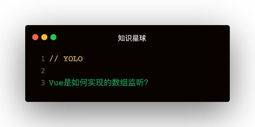

### 解答
鉴于defineProperty直接监听索引的两个问题：
1. 新增属性无法监听
2. 数组元素的重复get和set   

defineProperty直接监听索引这个方案就被KO了。   

**Vue2的数组监听实现方式**
1. 变异方法：重写数组实例的__proto__
2. 监听数组中的引用对象   

```
const arrayProto = Array.prototype
const arrayMethods = Object.create(arrayProto)
const methods = ['unshift', 'shift', 'push', 'pop', 'sort', 'reverse', 'splice']

methods.forEach(method => {
  const originalMethod = arrayMethods[method]
  Object.defineProperty(arrayMethods, method, {
    value: function (...args) {
      originalMethod.apply(this, args)
      let inserted;
      switch (method) {
        case 'unshift':
        case 'push':
          inserted = args
          break
        case 'splice':
          inserted = args.slice(2)
          break
      }
      const __ob__ = this.__ob__
      if (__ob__) {
        if (inserted) observeArray(inserted)
        this.__ob__.otify()
      }
    }
  })
})

arr.__proto__ = arrayMethods
```   

其次还有observeArray:   
```
function observeArray (arr) {
  for (let item of arr) {
    observe(item)
  }
}
```   

这种处理方式：需要使用方法去操作数组，如果使用arr[0] = 1这样仍是没用的