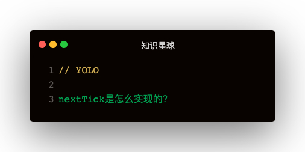

### 解答
next-tick其实是vue的任务调度核心，里面有个任务队列，还有各种兼容性的异步处理方案，匹配到最合适的异步方案来刷任务队列

#### 自己实现
```
let callbacks = []
function flushCallback () {
  pending = false
  for (let callback of callbacks) {
    callback()
  }
  callbacks.length = 0
}
let timerFunc
const isNative = Ctor => typeof Ctor === 'function' && /[native code]/.test(Ctor.toString())
if (typeof Promise !== 'undefined' && isNative(Promise)) {
  const p = Promise.resolve()
  timerFunc = () => {
    p.then(flushCallback)
  }
} else if (typeof MutationObserver !== 'undefined' && isNative(MutationObserver)) {
  let counter = 1
  const textNode = document.createTextNode(String(counter))
  const observer = new MutationObserver(flushCallback)
  observer.observe(textNode, {
    characterData: true
  })
  timerFunc = () => {
    counter = (counter + 1) % 2
    textNode.data = String(counter)
  }
} else if (typeof setImmediate !== 'undefined' && isNative(setImmediate)) {
  timerFunc = setImmediate(flushCallback)
} else {
  timerFunc = setTimeout(flushCallback, 0)
}

let pending = false
function nextTick (callback, context) {
  callbacks.push(() => {
    callback ? 
      callback.call(context) 
      : (typeof Promise !== 'undefined' ? Promise.resolve(context) : void 0)
  })
  if (!pending) {
    pending = true
    timerFunc()
  }
}
```