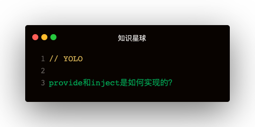

#### 几个问题
1. provide和inject是如何实现的
2. inject注入的时机，注入之后还能根据源数据变化而变化吗？

#### 入口
入口在_init函数中，initInjections(vm) & initProvide(vm)

#### initProvide的实现
```
function initProvide (vm) {
  const provide = vm.$options.provide
  if (provide) {
    vm._provided = typeof provide === 'function' ? provide.call(vm) : provide
  }
}
```   

provide的实现比较简单，只是把provide的json数据存储在vm._provided上   

#### initInjections的实现
```
function initInjections (vm) {
  let ret = resolveReject(vm)
  if (ret) {
    const keys = Object.keys(ret)
    toggleObserving(false)
    for (ley key of keys) {
      defineReactive(vm, key, ret[key])
    }
    toggleObserving(true)
  }
}

function resolveReject (vm) {
  let result = {}
  const inject = vm.$options.inject
  if (inject) {
    const keys = Object.keys(inject)
    for (let key of keys) {
      let source = vm
      const propKey = inject[key].from
      while (source) {
        if (source._provided && source._provided.hasOwnProperty(propKey)){
          result[propKey] = source._provided[propKey]
          break
        }
        source = source.$parent
      }
    }
  }
  return result
}
```   

#### 注意点
往自组件注入依赖时，会访问父组件的provide数据，此时provide数据已被响应式，所以需要先toogleObserving(false)，由此可见响应式定义开关是非常必要的