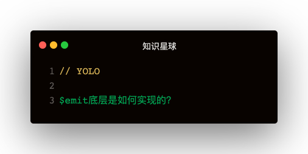

#### 几个问题
- 事件移除$off时这几种场景分别怎么办
  - 没有参数
  - 第一个参数是数组
  - 没有事件
  - 移除事件
- $once函数实现用了什么骚操作？

```
function initEvents (vm) {
  vm._events = Object.create(null)
}

Vue.prototype.$on = function (event, fn) {
  const vm = this
  if (Array.isArray(event)) {
    for (let e of event) {
      vm.$on(e, fn)
    }
  } else {
    (vm._events[event] || (vm._events[event] = [])).push(fn)
  }
  return vm
}

Vue.prototype.$once = function (event, fn) {
  const vm = this
  function on (...args) {
    vm.$off(event, fn)
    fn.apply(vm, args)
  }
  on.fn = fn
  vm.$on(event, fn)
  return vm
}

Vue.prototype.$off = function (event, fn) {
  const vm = this
  if (!arguments.length) {
    vm._events = Object.create(null)
    return vm
  }
  if (Array.isArray(event)) {
    for (let e of event) {
      vm.$off(e, fn)
    }
    return vm
  }

  const cbs = vm._events[event]
  if (!cbs) {
    return vm
  }

  let cb
  let i = cbs.length
  while (i--) {
    cb = cbs[i]
    if (cb === fn || cb.fn === fn) {
      cbs.splice(i, 1)
      break
    }
  }
  return vm
}

Vue.prototype.$emit = function (event, ...args) {
  const vm = this
  let cbs = vm._events[event]
  for (let cb of cbs) {
    cb.apply(vm, args)
  }
}
```