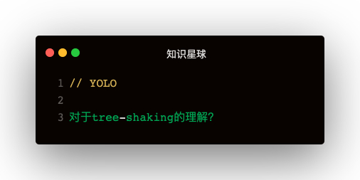

#### 解答
- 1.webpack生产模式下默认开启tree-shaking
- 2.由于babel把class等封装成IIFE，存在副作用导致tree-shaking失效
- 3.手动设置无副作用：
  - 3.1module下的rule.sideEffects: false
  - 3.2package.json下的sideEffects: false
- 4.依赖于es6 import的静态分析，函数可以被shaking   
- 5.tree shaking的过程发生在压缩阶段
  - webpack由于uglify的缘故，导致babel宽松模式下的class也无法被shaking
  - uglify可以设置pure_getters来避免获取对象属性的副作用

**副作用：**   
1. 一个函数会，或者可能会对函数外部变量产生影响的行为   
2. 获取对象的属性也会产生副作用

#### babel编译一个class
```
class Person {
  constructor(name){
    this.name = name;
  }
  getName () {
    return this.name
  }
}
```   

编译之后👇：
```
var _createClass = function (constructor, protoProps) {
  for (let descriptor of protoProps) {
    descriptor.enumerable = descriptor.enumerable || !1
    descriptor.configurable = !0
    Object.defineProperty(constructor.prototype, descriptor.key, descriptor)
  }
}
var Person = function () {
  function Person (name) {
    this.name = name;
  }
  _createClass(Person, [{
    key: 'getName',
    value: function getName() {
      return this.name;
    }
  }]);
  return Person;
}()
```   

**babel为什么这样做，要用defineProperty来赋属性，而不是定义一个function Person, Person.prototype = { getName }：**   
因为ES6的【类内部声明的方法，是不可枚举的，而通过原型链声明的方法是可以枚举的】   

babel有一种宽松模式：
```
{
  "presets": [["env", { "loose": false }]]
}
```   

宽松模式下class会被编译为原型链的方式，这时用rollup打包class可以被shaking掉


#### tree-shaking的最佳实践
1. 将每一个组件或者功能函数，都打包成单独的文件或目录，比如Button单独打包，单独导出：babel-import-plugin
2. 尽量不要写带有副作用的代码，比如编写了IIFE，函数里又使用了外部变量
3. 对ES6语义不是特别严格的，可以开启babel的loose模式，rollup shaking能力提高很多
4. uglify有pure_getter: true的配置，不过不建议使用
5. React的hooks有利于tree shaking，因为tree shaking对函数的效果更好